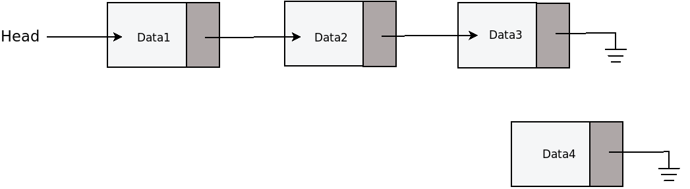

# Linked List

A linked list is a data structure in which the objects are arranged in
a linear order. 


## Singlely Linked List Implementation
Each node can be implemented in C as a `struct` that contains a variable for the data
and a variable that points to the next node in the list. 


```C
/* Simple node for list */
struct node{
  int data; /* Data held by node */
  struct node *next; /* Address of next node */
};
```

New nodes can be created in our main function by making a call to `struct node` 
with nodes `n1` to `n5` created by declaring them as type `struct node`. With
the nodes created; data can be assigned to their `data` member ,e.g. `n1.data = 22`.

The nodes are linked together by assigning the address of one node to the `next` 
member variable of another, e.g. `n1.next = &n2`


```C
  struct node n1;
  struct node n2;
  struct node n3;
  struct node n4;
  struct node n5;

  /* Give each node data */
  n1.data = 22;
  n2.data = 10;
  n3.data = 9;
  n4.data = -45;
  n5.data = 1024;

  /* Now link them all together (create the linked list) */
  n1.next = &n2; /* n1.next is assigned the address of n2 */
  n2.next = &n3; /* n2.next is assigned the address of n3 */
  n3.next = &n4; /* n3.next is assigned the address of n4 */
  n4.next = &n5; /* n4.next is assigned the address of n5 */
  /* n5.next is assigned NULL to indicate it's the end of the list */
  n5.next = NULL; 
```

To print the elements of the list, we'll create a pointer node called 
`current` that pointes
to the first node in the list. Once we have printed the data in the list
our pointer node will move down the list by assigning itself to the next node 
in the list via `current = current->next`.

```
  //This will be the pointer we move from one node to the other
  struct node *current = NULL;

  current = &n1; //Get the address of n1
  fprintf(stdout, "Data: %d\n", current->data); //Print data of n1
  
  /* Now remember, n1 was assigned the address of n2 (n1.next = &n2) */
  /* So to get the address of n2 we can simply do the following */

  /* Here we get the address of n2 and make it the current node */
  current = current->next; 
  fprintf(stdout, "Data: %d\n", current->data); //Print data of n2

  /* Now remember, n2 was assigned the address of n3 (n2.next = &n3) */
  /* So to get the address of n3 we can simply do the following */


  /* Here we get the address of n3 and make it the current node */
  current = current->next; 
  fprintf(stdout, "Data: %d\n", current->data); //Print data of n3

  /* Now remember, n3 was assigned the address of n4 (n3.next = &n4) */
  /* So to get the address of n3 we can simply do the following */

  /* Here we get the address of n4 and make it the current node */
  current = current->next; 
  fprintf(stdout, "Data: %d\n", current->data); //Print data of n4

  /* Now remember, n4 was assigned the address of n5 (n4.next = &n5) */
  /* So to get the address of n5 we can simply do the following */

  /* Here we get the address of n5 and make it the current node */
  current = current->next; 
  fprintf(stdout, "Data: %d\n", current->data); //Print data of n5

```


## Converting the linked list implementation into an ADT
An Abstract Data Type (ADT) is a structure that contains both data and operations on that data. 

### Creating new nodes and printing the list
Our current implementation hard codes the printing of the linked list by manually
moving the `current` node down the list until all the values are printed out. 

This can be accomplisted by using a function that takes the `current` node as 
input and recursively prints `current.data` until a `NULL` node is encountered. 

```C
void printList(struct node *current){
    if(current != NULL){
      fprintf(stdout, "Data: %d\n", current->data); 
      printList(current->next);
    }
}
```

**Question**:
Write a function that prints the list in reverse.

Similarly, the creation of new nodes can be done with a function.

```C
 struct node createNode(int data){
    struct node newNode;
    newNode.data = data;
    return newNode;
}
```
The creation, linking and printing of our linked list can now be shortened as
shown 
below.

```
  struct node n1 = createNode(22);
  struct node n2 = createNode(10);
  struct node n3 = createNode(9);
  struct node n4 = createNode(-45);
  struct node n5 = createNode(1024);


  /* Now link them all together (create the linked list) */
  n1.next = &n2; /* n1.next is assigned the address of n2 */
  n2.next = &n3; /* n2.next is assigned the address of n3 */
  n3.next = &n4; /* n3.next is assigned the address of n4 */
  n4.next = &n5; /* n4.next is assigned the address of n5 */
  /* n5.next is assigned NULL to indicate it's the end of the list */
  n5.next = NULL; 

  /* Now to print the list moving from node to node */
  //This will be the pointer we move from one node to the other

  struct node *current = NULL; 
  current = &n1; //Get the address of n1

 /*Call the print function to iterate through the list and print each element*/
  printList(current);
```

We have successfully been able to abstract our the creation and printing of 
new nodes, however, what about adding new nodes to the list?

### Typedef and Pointers
Our goal here is to create an ADT, which means that we have to create a number of 
functions to that modifies and operate on our list data structure. In our current
implementation, we are passing the entire value of the list to these functions to
operate on. This becomes inefficient as lists grows larger because chunks of memory
must be created an distroyed for these operations to occur. 

Instead of passing the value of the list to the functions, we are going to pass 
its address instead. 

We achieve this by now declaring our list as a pointer, so declaring a node becomes
`struct node *n1`. The code to create the nodes and print them becomes:
  
```
  struct node *n1 = createNode(22);
  struct node *n2 = createNode(10);
  struct node *n3 = createNode(9);
  struct node *n4 = createNode(-45);
  struct node *n5 = createNode(1024);


  /* Now link them all together (create the linked list) */
  n1->next = n2; /* n1.next is assigned the address of n2 */
  n2->next = n3; /* n2.next is assigned the address of n3 */
  n3->next = n4; /* n3.next is assigned the address of n4 */
  n4->next = n5; /* n4.next is assigned the address of n5 */
  /* n5.next is assigned NULL to indicate it's the end of the list */
  n5->next = NULL; 

  /* Now to print the list moving from node to node */
  //This will be the pointer we move from one node to the other

  struct node *current = NULL; 
  current = n1; //Get the address of n1

 /*Call the print function to iterate through the list and print each element*/
  printList(current);
```


Because we are only creating a variable that stores the address of the nodes, 
we need to manually allocate chunks of memory from the heap by calling
the `malloc` function. 

```
struct node *createNode(int data){
    struct node *newNode = malloc(sizeof(struct node));

    //make sure that the memory was correctly allocated
    if(newNode == NULL){
        printf("Out of memory");
        exit(1);
    }
    newNode->data = data;
    newNode->next = NULL;
    return newNode;
}
```

In this course we will be passing pointers around and pointers to pointers and 
even pointers to pointers to pointers at some point. While dealing with data structures
this can get overwhelming. Fortunately, C has the `typedef` keyword that allows us to add 
aliases to these data type and makes implementation a bit more managable. 

`typedef` is simply an alias for a datatype. E.g.

```
typdef int myNumber;
myNumber n = 5
```
Here `myNumber` is just an alias for `int`.

Rather than calling `struct node n1` to declare a node, we can use typedef on
our struct implementation to make node creation a bit shorter.

```
typedef struct _node{
  int data;
  struct _node *next;
} node, *nodePtr;
```

A node can simpily be created using `node n1` or a pointer to a node as `nodePtr n1`
We can use typedef to create multiplie aliases for the same data type in order 
to differential it between the different context that these data types are used. 

```
typedef nodePtr List
```
Here we created a alias for nodePtr that will help us to distinguish between
a node in the list and a node to represent the entire list itself (more on this 
later.)

Putting these together, our entire program now becomes: 

```
#include <stdio.h>
#include <stdlib.h>

/* Simple node for list */
typedef struct _node{
  int data; /* Data held by node */
  struct _node *next; /* Address of next node */
} node, *nodePtr;
typedef nodePtr List;

void printList(nodePtr current);
nodePtr createNode(int data);

int main()
{
  /* Now create several nodes*/
  nodePtr n1 = createNode(22);
  nodePtr n2 = createNode(10);
  nodePtr n3 = createNode(9);
  nodePtr n4 = createNode(-45);
  nodePtr n5 = createNode(1024);


  /* Now link them all together (create the linked list) */
  n1->next = n2; /* n1.next is assigned the address of n2 */
  n2->next = n3; /* n2.next is assigned the address of n3 */
  n3->next = n4; /* n3.next is assigned the address of n4 */
  n4->next = n5; /* n4.next is assigned the address of n5 */
  n5->next = NULL; 

  /* Now to print the list moving from node to node */
  nodePtr current = NULL;

  current = n1; //Get the address of n1
  printList(current);

  return EXIT_SUCCESS;
}

void printList(nodePtr current){
    if(current != NULL){
      fprintf(stdout, "Data: %d\n", current->data); 
      printList(current->next);
    }
}


nodePtr createNode(int data){
    nodePtr newNode = malloc(sizeof(struct node));

    //make sure that the memory was correctly allocated
    if(newNode == NULL){
        printf("Out of memory");
        exit(1);
    }
    newNode->data = data;
    newNode->next = NULL;
    return newNode;
}

```

### Destroying the list
Manually allocating memory from the heap comes with the disadvantage of having to
also doing manual garbage collection. 

Whenever we use `malloc` to create memory for our pointer, that memory now becomes
reserved. If this memory is not cleaned up whenever it is no longer needed, it 
becomes unusable to the program. 

C provides the `free` function that allows us to reclaim memory that is no longer
being used. 

```
//create memory for the pointer variable p
int *p = malloc(sizeof(int));

...

//free the memory when it is no longer needed
free(p);
```

Having created new nodes and allocated memory from the heap, we need to manual 
destroy the list before the program exits. This can be done with the following function:

```
void LIST_distroy(List *l){
    nodePtr current = *l;
    nodePtr next;

    while(current != NULL){
        next = current->next;
        free(current);
        current = next;
    }

    *l = NULL;
}

```

### Generic List Elements
If we want our list to operate on any datatype rather than just integers we can
make use of the void pointer. By declaring a node's data as a void pointer gives it 
the advantage of being able to be cast into any other type that we wish. 

We'll find define a node data alias as: 

```
typedef void *nodeData;
```

Then change the structure to:

```
typedef struct _node{
    nodeData data;
    struct _node *next;
} node, *nodePtr;

```

Next the argument of the `createNode` function will be modified as:  

```
nodePtr createNode(nodeData data){
//the rest of the function remains the same. 
}
```
The next bit of modification to be done is the printing of the elements of the list. 
Since the data of the list can be of any type, we'll need to a list print function that
not only takes the list as an input but a print callback function that is unique 
to the datatype of the list. 

As was done with the insertion sort lab, we'll have to use function pointer to
achieve passing functions to other functions.

Define a generic print callback function as:

```
typedef void (* printFunction)(const void *data);
```

We will create a new print list function where the arguments are the list itself 
and the print callback function:

```C
void LIST_print(List l, printFunction f){
    while(l != NULL){
        f(l->data);
        l = l->next;
    }
}
```

Lets say our list data are actually integers. We can now defined a printInt function
as:

```
void printInt(const void *data){
    fprintf(stdout, "data: %d\n", *(int *)data);
}

```

Calling the `List_print` function in the main body of our program is simply:

```C
LIST_print(l, printInt);
```

### Appending to the List
Appending to a list means we want to add an element to the tail of the list (the
last element).



The last element of the list usually points to null, hence `last->next == NULL`.
Since new nodes are already created with its next element pointing to null, 
we just need to just need to point the last node to the new node `last->next = newNode`.


We would like to rewrite our code from manually adding nodes to using a function
that finds the last element of the list and adds our new node to it. 

```C
void LIST_append(nodePtr current, nodeData data){
    nodePtr newNode = createNode(data);
    
	while(current->next != NULL){
		current = current->next;
	}

	current->next = newNode;
}
```

This code has a major flaw. What if the list was already empty? 

We need to test if the list is already empty, then make the first element the 
new node, if not empty then find the last node and point it to the new node. 

```C
void LIST_append(nodePtr current, nodeData data){
    nodePtr newNode = createNode(data);
   
	if(current == NULL){
		current = newNode;
	} 
	else{
		while(current->next != NULL){
			current = current->next;
		}	
		current->next = newNode;
	}
}
```

Unfortunately .. this doesn't work either. 

So what are we missing here?

Remember that `current` is pointer to a `struct`. By assigning it to `newNode` via
`current = newNode`, we are asking the code to overwrite the pointer. However, C uses
pass by value and pointers cannot be overwritten this way. 

What we need is to pass a pointer to a pointer (a double pointer :)) in the 
function argument then deference the pointer in order to overwrite it. 

```C
void LIST_append(nodePtr *head, nodeData data){
    NodePtr current = *head;
	nodePtr newNode = createNode(data);
   
	if(*head == NULL){
		*head = newNode;
	} 
	else{
		while(current->next != NULL){
			current = current->next;
		}	
		current->next = newNode;
	}
}
```

That's better.

Let's clean this up a bit and make things a bit more readable

```
void LIST_append(nodePtr *head, nodeData data){
    nodePtr current = *head;
    nodePtr newNode = createNode(data);

    if(LIST_isEmpty(*head)){
        *head = newNode;
    }
    else{
        LIST_last(current)->next = newNode;
    }
}

int LIST_isEmpty(List l){
    return l == NULL;
}

nodePtr LIST_last(List l){
    while(l->next != NULL)
        l = l->next;

    return l;
}

```